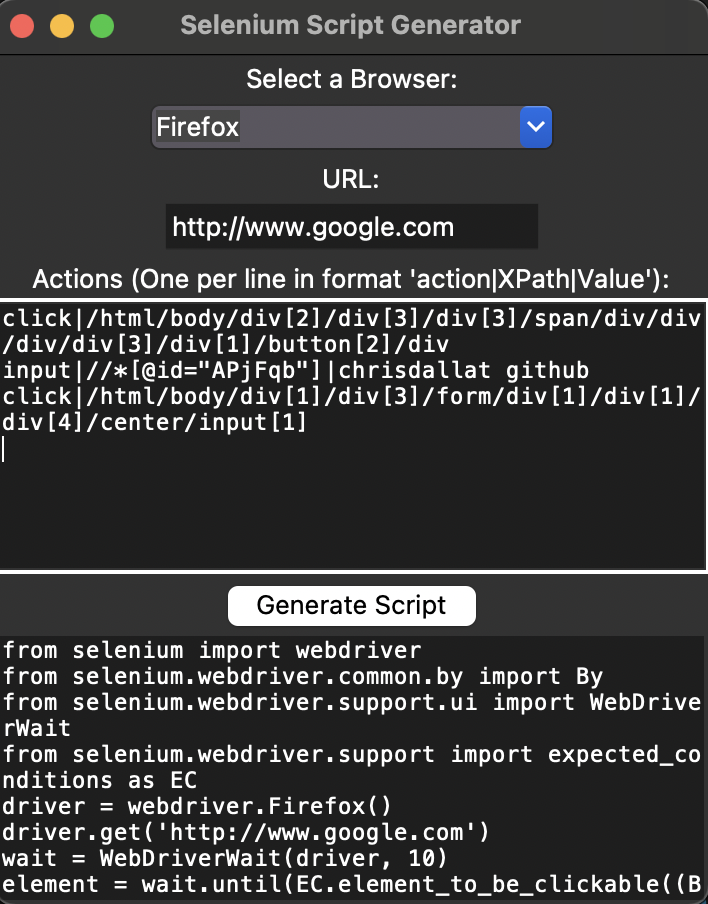

## Script Generator GUI

Other option, simple GUI to input commands for generating automatic selenium scripts, takes a little to input the xpaths, by "right clicking elements > copy > xPATH"

## Usage

so choose the browser, then input the base URL then go to input the actions you want on newlines
so the format is for example as so:

action|xPath|[optional depending on action]

click|/html/body/div[2]/div[3]/div[3]/span/div/div/div/div[3]/div[1]/button[2]/div
input|//*[@id="APjFqb"]|chrisdallat github
click|/html/body/div[1]/div[3]/form/div[1]/div[1]/div[4]/center/input[1]

(*this example will generate script to open private firefox browser on google, click accept cookies and enter in 'chrisdallat github' and click search*)

then click generate and it will show the code it generated so you can copy paste, and also will output it to a file called 'script.py' so you can just straight run it. 

